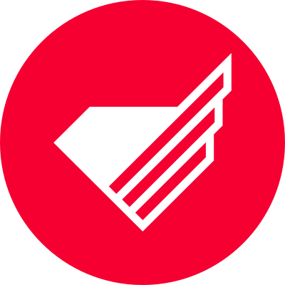

# Monterail Brand Skill

Apply Monterail's visual identity and brand voice consistently across all generated artifacts.

## ⚠️ Non-Negotiable Rules

1. **Capitalization:** Always write **Monterail** (capital M). The lowercase `monterail` form exists *only* inside the official logo wordmark graphic — never in prose, code comments, filenames, slide text, or any other context.
2. **Logo:** Always use the official SVG files from the `assets/` directory — never approximate or redraw the logo.
3. **Colors:** Use exact hex codes from this skill — never approximate or substitute brand colors.
4. **Typography:** Use **Basier Circle** — never Poppins, Inter, or any other substitute unless an explicit fallback is needed.

---

## Design System Overview

Monterail's brand is modern, geometric, and confident. It uses bold red accents against dark backgrounds, clean sans-serif typography, and a distinctive geometric sygnet motif as a decorative element. The design philosophy emphasizes **sophisticated restraint** — minimalist, never overdesigned, with generous whitespace. Dark backgrounds are the primary mode — the website, presentations, and key materials favor light-on-dark compositions.

---

## Color Palette

Use these exact hex values. Do not approximate or substitute.

### Primary Colors (Księga Znaku 2022)

| Name | Hex | Pantone | Role |
|------|-----|---------|------|
| **Monterail Red** | `#F50031` | 485C | Logo sygnet, primary accent, CTAs, highlights |
| **Monterail Dark** | `#181016` | Black 3CP | Primary dark bg, text on light, logo wordmark |
| **White** | `#FFFFFF` | — | Text on dark, primary light background |

> **CRITICAL:** The brand red is `#F50031` (not `#ED0133` which is a deprecated earlier proposal). Do not substitute.

### Extended Palette

| Name | Hex | Role |
|------|-----|------|
| **Red Dark** | `#330818` | Hover states on red buttons, dark red backgrounds |
| **Purple Dark** | `#2B1D5C` | Alternative dark section background, deep accents |
| **Purple** | `#6D58B4` | Secondary accent, tags, badges |
| **Green** | `#51C1B2` | Success states, secondary highlights, data viz |
| **Grey Dark** | `#939BA0` | Muted text, captions, secondary labels |
| **Grey** | `#DDE3E7` | Borders, dividers |
| **Grey Light** | `#F3F5F6` | Light backgrounds, cards on white |

### Color Usage Rules

- **Red (`#F50031`) is the signature accent** — use for primary buttons, active states, key highlights, and the sygnet. Never fill large background areas in Red (exception: the social media avatar circle).
- **Dark (`#181016`)** is the primary background for hero/header sections.
- **Purple Dark (`#2B1D5C`)** is an approved alternative dark section background.
- **Text:** White on dark, Dark on light, Grey Dark for secondary/muted text.
- **Contrast:** Maintain strong contrast — avoid Grey Dark text on Grey backgrounds.

---

## Typography

### Logo Typeface

The Monterail logotype wordmark uses the **Dr** typeface by productiontype.com — **for the logo only**. Never use Dr for general content. The wordmark always appears in lowercase: `monterail`.

### Content Typeface: Basier Circle

All digital and print content uses **Basier Circle** by Atipo Foundry. This is the official brand content typeface, present in the brand font files (`basiercircle-regular-webfont.woff2`, etc.).

**Import via Fontshare CDN (use in all HTML/React artifacts):**

```html
<link href="https://api.fontshare.com/v2/css?f[]=basier-circle@400,500,600,700&display=swap" rel="stylesheet">
```

### Type Scale

| Element | Weight | Size | Notes |
|---------|--------|------|-------|
| H1 | 700 Bold | 44px / 2.75rem | Page/slide titles |
| H2 | 600 SemiBold | 32px / 2rem | Section headers |
| H3 | 600 SemiBold | 24px / 1.5rem | Subsection headers |
| H4 | 500 Medium | 18px / 1.125rem | Card titles, labels |
| H5 | 500 Medium | 14px / 0.875rem | Small headers, tags |
| Body | 400 Regular | 16px / 1rem | Default paragraph text |
| Body Small | 400 Regular | 14px / 0.875rem | Secondary body text |
| Caption | 400 Regular | 10px / 0.625rem | Footnotes — always UPPERCASE, letter-spacing 0.05em |

### Typography Rules

- `font-family: 'Basier Circle', sans-serif;` for all text
- Line height: 1.5 for body, 1.2 for headings
- Captions always uppercase with `letter-spacing: 0.05em`
- Never use serif or monospace fonts for UI text
- Heading weights: always 500 or above

---

## Layout & Spacing

Use an 8px base grid:

| Token | Value | Use |
|-------|-------|-----|
| `xs` | 4px | Tight internal padding |
| `sm` | 8px | Between related elements |
| `md` | 16px | Standard padding |
| `lg` | 24px | Section internal padding |
| `xl` | 32px | Between sections |
| `2xl` | 48px | Major section breaks |
| `3xl` | 64px | Page-level margins |

- Content max-width: 1200px for web artifacts, centered
- Card border-radius: 8px — consistent, never pill-shaped
- Shadow for elevation: `0 2px 8px rgba(24, 16, 22, 0.08)`
- Prefer whitespace over borders — use Grey (`#DDE3E7`) 1px borders sparingly

---

## Logo Assets

All logo files are in the `assets/` directory as pixel-perfect SVGs derived from the official Księga Znaku.

### Available Files

| File | Dimensions | Description | Use When |
|------|-----------|-------------|----------|
| `assets/logo-color.svg` | 240×57px | Wordmark + sygnet, wordmark in `#181016`, sygnet in `#F50031` | Light/white backgrounds (preferred) |
| `assets/logo-black.svg` | 240×57px | Full logo in `#181016` monochrome | Print, single-color use |
| `assets/logo-white.svg` | 240×57px | Full logo in `#FFFFFF` | Dark/colored backgrounds |
| `assets/sygnet-color.svg` | 55×57px | Sygnet only in `#F50031` | Favicon, compact spaces, light bg |
| `assets/sygnet-black.svg` | 55×57px | Sygnet only in `#181016` | Monochrome / print compact |
| `assets/sygnet-white.svg` | 55×57px | Sygnet only in `#FFFFFF` | Compact space on dark bg |
| `assets/avatar.svg` | 400×400px | Red circle (`#F50031`) + white sygnet | Social media profiles, avatars |

### Usage in Artifacts

```html
<!-- Full logo on light background -->


<!-- Full logo on dark background -->


<!-- Sygnet only in header (dark bg) -->


<!-- Social media / avatar -->

```

### Logo Rules (from Księga Znaku)

- **Clear zone:** Minimum clear space on all sides equals the height of the `M` stroke in the wordmark.
- **Sygnet colors:** Only Red (`#F50031`), White (`#FFFFFF`), or Dark (`#181016`) — no other colors.
- **Forbidden:** Never change proportions, rotate, distort, add drop shadows, use unapproved colors, or modify the wordmark font.
- **Position:** Top-left or top-center of layouts.
- The wordmark always reads `monterail` (lowercase inside the graphic) — never change this.

---

## Visual Motifs

### Geometric Decorative Pattern

Monterail uses a distinctive decorative motif derived from the sygnet shape: **nested concentric sygnet outlines** that create a labyrinthine, chevron-like geometric pattern. This appears on brand presentations, website backgrounds, printed materials, and event graphics.

Implementation in HTML/CSS:

```html
<!-- Decorative geometric accent (corner/edge element) -->
<div class="monterail-motif" aria-hidden="true"></div>
```

```css
.monterail-motif {
  position: absolute;
  width: 320px;
  height: 320px;
  background-image: url("assets/sygnet-color.svg");
  background-repeat: no-repeat;
  background-size: 100%;
  opacity: 0.06;
  pointer-events: none;
}

/* Scale up and position as background accent */
.section-with-motif {
  position: relative;
  overflow: hidden;
}
.section-with-motif::after {
  content: '';
  position: absolute;
  right: -80px;
  bottom: -80px;
  width: 400px;
  height: 400px;
  background-image: url("assets/sygnet-color.svg");
  background-size: cover;
  opacity: 0.05;
  pointer-events: none;
}
```

For layered/concentric effect, stack multiple sygnet instances at increasing scale (120%, 150%, 180%) with low opacity.

### Pattern Usage Rules

- Motifs are **accent elements** — they complement content, never compete with it.
- Use in corners, edges, or as subtle overlaying background elements.
- Opacity: 0.04–0.08 on colored sections; 0.08–0.12 on white sections.
- Red sygnet on dark backgrounds, dark sygnet on light backgrounds.
- Never fill an entire surface with the pattern.

---

## Brand Voice & Messaging

### Tone of Voice

- **Professional, confident, welcoming** — not corporate-stiff, not startup-casual
- **Expert, not arrogant** — share knowledge generously
- **Direct and clear** — no jargon without explanation
- **Warm and human** — tech company run by real people

### Brand Promise & Positioning

- **Tagline:** "The New Default" — positioning as the industry standard
- **Brand promise:** "Every great product starts with a conversation"
- **Brand personality:** Ambitious, Trustworthy, Innovative, Human-centered, Professional

### Messaging Architecture

1. **Primary:** "The New Default" — the standard in the industry
2. **Secondary:** Partnership and long-term relationships
3. **Tertiary:** Quality, expertise, proven track record

### Content Style

**Use:**
- Partnership-oriented language ("together", "our collaboration", "your partner")
- Value-driven messaging (results, impact, outcomes)
- Storytelling through case studies
- Direct, one-sentence CTAs
- Confident, clear statements

**Avoid:**
- Transactional language ("vendor", "provider", "supplier")
- Corporate clichés ("synergy", "leverage", "best-in-class")
- Overly salesy copy
- Generic tech buzzwords without substance
- Passive voice in CTAs

### Core Values

1. **Keep the professional promise** — collaboration, technical expertise, transparent communication
2. **Get things done** — ownership, accountability, solutions over blame
3. **Evolve and adapt** — continuous learning, innovation balanced with best practices
4. **Embrace diversity** — inclusive culture, different perspectives drive innovation

---

## Company Facts

| Fact | Value |
|------|-------|
| Founded | 2009 |
| Location | Wrocław, Poland (ul. Oławska 27-29) |
| Team size | 130+ experts |
| Projects completed | 900+ |
| NPS score | 71 |
| Co-CEOs | Szymon Boniecki & Bartosz Rega |
| Email | hello@monterail.com |
| Phone | +48 533 600 136 |
| Website | www.monterail.com |

### Key Partnerships & Credentials

- Official Vue.js Partner (since 2019)
- Official Nuxt Partner (since 2024)
- Recognized by Clutch, Financial Times 1000 (2018), Deloitte (2016)
- Acquired Untitled Kingdom (MedTech, 2024) and ElPassion (product design, 2025)

### Service Lines

Web Development · Mobile Development · Product Design (UI/UX)

### Notable Clients

Bosch, Doctolib, EY, Merck, SharkNinja

---

## Component Patterns

### CSS Variables (use in every HTML/React artifact)

```css
:root {
  /* Brand colors */
  --monterail-red:          #F50031;
  --monterail-red-dark:     #330818;
  --monterail-dark:         #181016;
  --monterail-purple-dark:  #2B1D5C;
  --monterail-purple:       #6D58B4;
  --monterail-green:        #51C1B2;
  --monterail-grey-dark:    #939BA0;
  --monterail-grey:         #DDE3E7;
  --monterail-grey-light:   #F3F5F6;
  --monterail-white:        #FFFFFF;

  /* Typography */
  --font-brand:    'Basier Circle', sans-serif;

  /* Spacing */
  --space-xs:  4px;
  --space-sm:  8px;
  --space-md:  16px;
  --space-lg:  24px;
  --space-xl:  32px;
  --space-2xl: 48px;
  --space-3xl: 64px;
}
```

### Buttons

```css
.btn-primary {
  background: var(--monterail-red);
  color: #fff;
  font-family: var(--font-brand);
  font-weight: 600;
  font-size: 14px;
  padding: 12px 24px;
  border-radius: 8px;
  border: none;
  cursor: pointer;
  transition: background 0.2s;
}
.btn-primary:hover { background: var(--monterail-red-dark); }

.btn-secondary {
  background: transparent;
  color: var(--monterail-red);
  border: 2px solid var(--monterail-red);
  font-family: var(--font-brand);
  font-weight: 600;
  font-size: 14px;
  padding: 12px 24px;
  border-radius: 8px;
  cursor: pointer;
  transition: all 0.2s;
}
.btn-secondary:hover { background: var(--monterail-red); color: #fff; }
```

### Cards

```css
.card {
  background: #fff;
  border-radius: 8px;
  padding: 24px;
  box-shadow: 0 2px 8px rgba(24, 16, 22, 0.08);
}
.card-dark {
  background: var(--monterail-purple-dark);
  color: #fff;
}
```

### Navigation / Header

Standard dark header with color logo:

```html
<link href="https://api.fontshare.com/v2/css?f[]=basier-circle@400,500,600,700&display=swap" rel="stylesheet">

<header style="background:#181016;padding:16px 32px;display:flex;align-items:center;justify-content:space-between;">
  
  <nav style="display:flex;gap:24px;">
    <a style="color:#fff;font-family:'Basier Circle',sans-serif;font-weight:500;text-decoration:none;">Services</a>
    <a style="color:#F50031;font-family:'Basier Circle',sans-serif;font-weight:500;text-decoration:none;">Work</a>
  </nav>
</header>
```

### Data Visualization Color Order

1. `#F50031` Red
2. `#6D58B4` Purple
3. `#51C1B2` Green
4. `#2B1D5C` Purple Dark
5. `#939BA0` Grey Dark

---

## Artifact-Specific Guidance

### HTML / React Artifacts

- Import Basier Circle from Fontshare CDN (see Typography section)
- Set `background: #ffffff` or `var(--monterail-grey-light)` for page body
- Use a dark (`#181016`) hero/header section with white text
- Use `assets/logo-white.svg` in dark headers, `assets/logo-color.svg` on light backgrounds
- Apply CSS variables pattern from Component Patterns above
- Add geometric motif as decorative corner element for visual richness (see Visual Motifs)

### Presentations (PPTX)

- Title slides: Dark (`#181016`) background, white Basier Circle text
- Default content slides: White or Grey Light background
- Stats slides: large Basier Circle Bold numbers in Red, descriptive text in Dark
- Red (`#F50031`) accents in corners — use geometric motif or simple angle shapes
- Section labels in uppercase Basier Circle caption style
- Include `assets/sygnet-color.svg` or `assets/logo-color.svg` on title and closing slides

### Documents (DOCX / PDF)

- Headings: Basier Circle Bold; body: Basier Circle Regular
- Red (`#F50031`) accent for horizontal rules or highlight boxes
- Grey Light (`#F3F5F6`) for callout/tip boxes
- Cover pages: Dark (`#181016`) background, white text, Red accents
- Include `assets/logo-white.svg` on cover; `assets/sygnet-color.svg` in footer

### Markdown Artifacts

- Use the color values in any inline HTML styling
- Map to type scale: H1=44px, H2=32px, H3=24px

---

## Anti-Patterns

- **NEVER write "monterail" in lowercase** outside the official logo graphic — always **Monterail** (capital M) in prose, headings, slide text, alt attributes, filenames, code comments
- **NEVER improvise the logo** — always use SVG files from `assets/`
- **NEVER use `#ED0133`** or other approximate reds — use the official `#F50031`
- **NEVER use Poppins, Inter, or other fonts** as primary brand font — use Basier Circle
- **NEVER use blue** as a primary color — Monterail's accent is Red (`#F50031`)
- **NEVER use pill/rounded-full buttons** — use 8px border-radius
- **NEVER use gradients** — Monterail uses flat, solid colors
- **NEVER use light font weights for headings** — Basier Circle headings are always 500+
- **NEVER put Red text on Dark backgrounds** for body text (use White; Red only for accents)
- **NEVER use generic Tailwind blue/indigo defaults** — override with Monterail palette
- **NEVER use generic stock imagery** — prefer professional photos of real people
- **NEVER use overly colorful, chaotic designs** — Monterail is restrained and minimalist
- **NEVER use transactional/vendor language** — always frame as partnership
- **NEVER modify logo proportions**, rotate, add effects, or recolor the sygnet outside the approved palette
